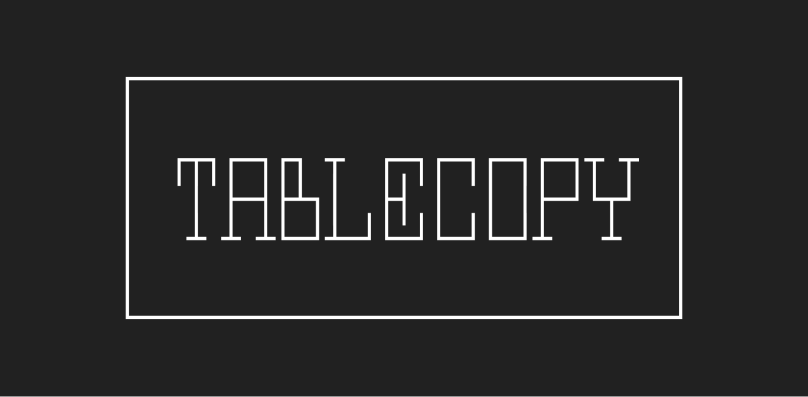

<p align="center">
  
</p>

<p align="center">
  <strong>ターミナルのテーブルをMarkdownや画像に変換するCLIツール</strong>
</p>

<p align="center">
  <a href="README.en.md">English</a>
</p>

---

Claude Code などの CLI ツールが出力する Unicode 罫線テーブルは、そのまま Slack や Notion にコピーすると崩れてしまいます。

tablecopy を使うと、ショートカット一つで Markdown や画像に変換できます。

## 使い方

### 1. ターミナルのテーブルをコピー

```
┌────────────┬──────┬──────────┐
│ 猫種       │ 毛種 │ 毛質     │
├────────────┼──────┼──────────┤
│ ミヌエット │ 長短 │ ふわふわ │
├────────────┼──────┼──────────┤
│ マンチカン │ 長短 │ やわらか │
├────────────┼──────┼──────────┤
│ ベンガル   │ 短毛 │ シルク   │
└────────────┴──────┴──────────┘
```

このままだと Slack や Notion に貼ると崩れてしまいます。

### 2. ショートカットを押して Markdown に変換

`Cmd+Ctrl+M`（macOS）を押すと、Markdown に変換されてクリップボードにセットされます。

```markdown
| 猫種 | 毛種 | 毛質 |
| --- | --- | --- |
| ミヌエット | 長短 | ふわふわ |
| マンチカン | 長短 | やわらか |
| ベンガル | 短毛 | シルク |
```

そのまま Notion に `Cmd+V` で貼り付けできます。

### 3. もう一度押して画像に変換

30 秒以内にもう一度 `Cmd+Ctrl+M` を押すと、テーブル画像に変換されます。

<!--  -->

日本語・絵文字にも対応した、きれいなテーブル画像がクリップボードにコピーされます。そのまま Slack に貼り付けできます。

### HUD 通知

変換が完了すると、画面に HUD 通知が表示されます。

<p align="center">
  
</p>

| OS | 通知方式 |
|---|---|
| macOS | ネイティブ HUD オーバーレイ |
| Windows | Toast 通知 |
| Linux | なし（ターミナル出力のみ） |

HUD の表示は `--hud` オプションで切り替えできます：

```bash
tablecopy --hud off   # 無効化
tablecopy --hud on    # 有効化（デフォルト）
```

## インストール

### Homebrew（macOS / Linux）

```bash
brew install wataame/tap/tablecopy
```

### Shell（macOS / Linux）

```bash
curl --proto '=https' --tlsv1.2 -LsSf https://github.com/wataame/tablecopy/releases/latest/download/tablecopy-installer.sh | sh
```

### PowerShell（Windows）

```powershell
powershell -ExecutionPolicy ByPass -c "irm https://github.com/wataame/tablecopy/releases/latest/download/tablecopy-installer.ps1 | iex"
```

### Cargo

```bash
cargo install tablecopy
```

### ショートカットの設定

インストール後、ショートカットキーを登録します：

```bash
tablecopy --install
```

| OS | ショートカット | 方式 |
|---|---|---|
| macOS | `Cmd+Ctrl+M` | Automator Quick Action |
| Windows | `Ctrl+Alt+M` | AutoHotkey v2 スクリプト |

> **Windows の場合**、[AutoHotkey v2](https://www.autohotkey.com/) のインストールが必要です。

### コマンドライン

ショートカットを使わずに直接実行もできます：

```bash
# クリップボードから変換（ショートカットと同じ動作）
tablecopy

# stdin から Markdown に変換
echo "┌───┬───┐..." | tablecopy -
```

### アンインストール

```bash
tablecopy --uninstall
```

## 対応テーブル形式

Unicode 罫線で描かれたテーブルを自動検出します。

| 種類 | 文字 | 例 |
|---|---|---|
| 細線（Light） | `┌─┐│└┘├┤┬┴┼` | Claude Code のデフォルト |
| 太線（Heavy） | `┏━┓┃┗┛┣┫┳┻╋` | 一部ツール |
| 二重線（Double） | `╔═╗║╚╝╠╣╦╩╬` | 一部ツール |

日本語・CJK 文字・絵文字を含むテーブルにも対応しています。

## 動作環境

| 項目 | 要件 |
|---|---|
| OS | macOS, Windows 10+ |
| ビルド | Rust 1.70+ |
| 依存 | なし（スタンドアロンバイナリ） |

## 仕組み

```
ターミナルでテーブルをコピー
  ↓
tablecopy がクリップボードを読み取り
  ↓
Unicode 罫線テーブルを自動検出・パース
  ↓
1回目 → Markdown に変換してクリップボードにセット
2回目 → SVG 生成 → Retina 2x で PNG レンダリング → 画像としてクリップボードにセット
  ↓
30秒以内に押すとサイクル（Markdown ↔ 画像）
```

画像レンダリングには [resvg](https://github.com/linebender/resvg)（Pure Rust の SVG レンダラー）を使用しています。

## フィードバック・貢献

使ってみて気になったことがあれば、お気軽に [Issue](https://github.com/wataame/tablecopy/issues) を立ててください！

PR も大歓迎です。

## ライセンス

[MIT](LICENSE)
